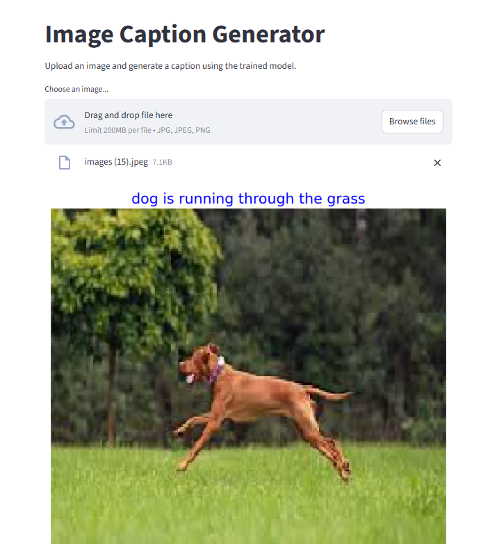

# Image-Caption-Generator
## Project Overview
This project generates descriptive captions for images using a deep learning model built with TensorFlow/Keras.
It combines a pretrained DenseNet201 for extracting image features and an LSTM network for generating relevant text descriptions.
A simple Streamlit interface allows users to upload images and get caption predictions locally.

## Dataset 
This project uses the dataset [Flickr 8k Dataset](https://www.kaggle.com/datasets/adityajn105/flickr8k) from Kaggle.
The Flickr8k Dataset is a benchmark collection widely used for image captioning tasks. It consists of:
8,000 images selected from six different Flickr groups.
Each image is paired with five distinct captions that clearly describe the main objects and events in the scene.
The dataset features diverse scenes and situations, avoiding well-known people or famous locations.
It provides rich, human-written descriptions ideal for training and evaluating image captioning models.

## Model Architecture
The model consists of two main parts:

**1. Feature Extraction Module**

-Utilizes a pretrained DenseNet201 backbone (trained on ImageNet) with the classification head removed.

-The output is a fixed-size 1920-dimensional feature vector representing high-level semantic information of the image.

**2. Caption Generation Module**

-The input caption sequences are tokenized and embedded using an Embedding layer that maps each word index to a dense vector representation.

-The embedded captions are concatenated with the image features to form a joint input representation.

-This combined input is fed into an LSTM (Long Short-Term Memory) network which models the temporal dependencies and generates hidden states for each word position.

-A Dense layer with softmax activation is applied at each time step to predict the probability distribution over the vocabulary for the next word in the sequence.

## Streamlit


## Installation
1.Clone the repository:
```
git clone https://github.com/velish-qubadov/Image-Caption-Generator.git
cd FakeOrRealFace
```
2.(Optional) Create and activate a virtual environment:

Windows:
```
python -m venv venv
venv\Scripts\activate
```
macOS / Linux
```
python3 -m venv venv
source venv/bin/activate
```
3.Install dependencies:
```
pip install -r requirements.txt
```
4.Run the Streamlit app:
```
streamlit run app.py
```
